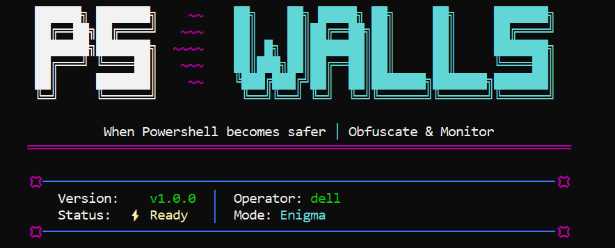

# PS~walls: Secure PowerShell Wrapper

**PS~walls** is a defensive security tool designed to act as a secure envelope around the Windows PowerShell engine. It provides a layer of visual obfuscation to prevent unauthorized physical access and enforces audited logging with threat detection. Additional Linux-inspired commands ensure that sensitive operations remain private and fully traceable before reaching PowerShell.



## 🛡️ Core Capabilities

- **`Visual Obfuscation`**: Real-time masking of terminal input & output to protect sensitive data from visual theft.
- **`Threat Detection`**: Pattern-based analysis of commands to identify and block potentially malicious activity (e.g., encoded payloads, bypass attempts).
- **`DPAPI Encryption`**: Uses **Windows Data Protection API** (`DPAPI`) to securely store master keys and session states, locked to the local user and machine.
- **`Secure Logging`**: Comprehensive JSON-structured audit trails of all interactions, stored in protected local directories.
- **`Auto-Lock`**: Inactivity monitoring that automatically enables obfuscation or deauthenticates the session after a period of idle time.

---

## 🏛️ The Execution Flow

1. **Input Capture**: The wrapper intercepts all keyboard input and performs real-time analysis to detect malicious patterns before any data reaches the shell.

2. **Encapsulated Communication**: The application spawns a hidden `powershell.exe` child process with communication handled through **Anonymous Pipes** (`stdin`/`stdout`), ensuring the underlying shell is never directly exposed.

3. **Command Validation**: Commands are logged and checked against security policies.

4. **Output Transformation**: Data returning from **PowerShell** is intercepted and transformed based on session state.

```powershell
Parent Process                 Child Process (PowerShell)
┌──────────────────────┐                    ┌───────────────────┐
│ Write pipe           │ ──[stdin]──────▶     Read pipe          
│  (m_hChildStdinWrite)                       (hChildStdinRead)
└──────────────────────┘                    └───────────────────┘
┌─────────────────────┐                     ┌────────────────────┐
│ Read pipe           │  ◀──[stdout]─────     Write pipe        
│ (m_hChildStdoutRead)                      │ (hChildStdoutWrite)
└─────────────────────┘                     └────────────────────┘
```

### ⚡ Main Technical Challenges & Solutions

Building this wrapper required solving several non-trivial engineering challenges:

- **`Sentinel Synchronization`**: Resolved asynchronous output "jumping" by injecting hidden signatures.
- **`Low-Level Interception`**: Used `_getch()` for custom buffer management with input **obfuscation**.
- **`ANSI Escape Preservation`**: Implemented filtering to maintain **PowerShell**'s native colors.
- **`DPAPI & Memory Security`**: Integrated **Windows** `DPAPI` with secure memory zeroing.
- **`Thread Orchestration`**: Eliminated deadlocks through recursive thread refactoring.
- **`Race Condition Mitigation`**: Refined synchronization for secure output buffer access.
- **`Session Containment`**: Blocked environment escapes via process monitoring.

- **Sentinel Sync:** Resolved asynchronous output "jumping" by injecting hidden signatures after commands, ensuring the prompt only returns after the output is fully piped.
- **Low-Level Interception:** Used `_getch` for custom buffer management, allowing input obfuscation without losing tab-completion or command history.
- **ANSI Preservation:** Implemented a filtering algorithm to bypass VT100 escape sequences, maintaining PowerShell’s native colors and table layouts.
- **DPAPI & Memory Security:** Integrated **Windows DPAPI** and `SecureZeroMemory` to bind encryption to user hardware and prevent data theft via memory dumps or file cloning.
- **Thread Orchestration:** Eliminated deadlocks through recursive thread refactoring, keeping UI and logging services non-blocking.
- **Race Condition Mitigation:** Refined synchronization logic to ensure security rules are applied to the output buffer before it reaches the user.
- **Session Containment:** Blocked "environment escapes" via process monitoring and window enforcement, forcing new PowerShell instances into secured wrappers.

---

## 🚀 Installation & Setup

### Prerequisites

- **Operating System**: Windows 10/11
- **Compiler**: C++17 compatible (MSVC 2019+ recommended)
- **Build System**: CMake 3.10+

### Building from Source

1. Open a Developer Command Prompt
2. Clone or Download the repository
3. Run the build script:
    
    ```bash
    git clone https://github.com/MizoxXXx/PS-walls.git
    cd PS-walls
    .\rebuild.bat
    ```
    

### First-Time Configuration

On the first launch, you will be prompted to set a master password:

1. Run `ps_wrapper.exe`
2. Enter: `setkey <your_password>`
3. Your key is securely encrypted via DPAPI at: `%LocalAppData%\PowerShellWrapper\`

Key files created:
- `.wrapper_key.dat`: Encrypted master keys
- `commandsLog.json`: Structured audit trail
- `Logs/`: Rotating text logs

4. View available commands with: `help` 

---

## 📋 Project Status

This tool is currently in **v1.0.0** (early prototype). While it provides active defense layers, it is not yet feature-complete.

### Current Limitations

- 🚧 **Basic Detection**: Threat signatures are currently limited (regex/heuristic expansion needed).
- ⚠️ **No MFA**: Lacks Multi-Factor Authentication for sessions.
- 🛡️ **Experimental**: Not yet audited for high-security production environments.

So , **PS~walls** is a living project with several planned enhancements:

- ⚔️ **Advanced Hardening**: Strengthening the core engine against sophisticated anti-debugging and process-injection techniques used by expert attackers.
- 🎭 **Stealth Obfuscation**: Refining the masking logic to be more seamless and visually undetectable to the casual eye.
- 🖥️ **Enhanced Intelligence**: Expanding the threat signature database and implementing "nice_errors" for clearer context-aware even with spelling mistakes … , security alerts ,shortcuts , new command/features/experience or lacking ones that exists in Linux but not in Windows terminal like `file` ; `ctrl + L` …
- 📊 **Analytics & Visualization**: Improving log visualization across different software and platforms and add new filters and be readable by different log readers
- 🗿 Better teamwork with powershell logic especially with future updates